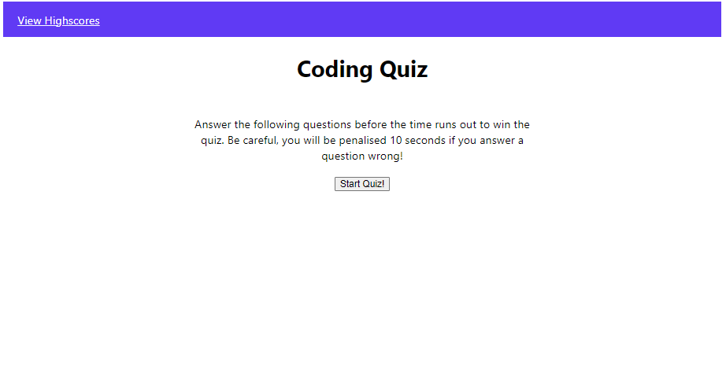
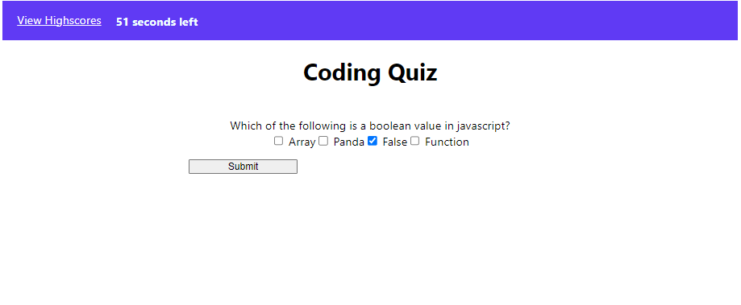
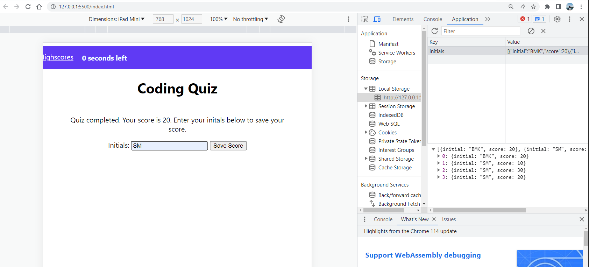

# <Coding Quiz>

## Description

This project was focused on building a simple quiz from scratch. Quizes are a very common application used on the internet. It is a fun and quiz way of testing someone's knowledge on any topic in the world!

On top of revisiting HTML, CSS, and Javascript the quiz app also utilzed several Web APIs like the use of attribute setting to change attributes of different elements, time intervals to time the quiz, event listeners to trigger the subsequent step during the quiz, local storage to store the user's quiz score and initials, etc. 

## Installation

N/A

## Usage

The user will land on a introductory page about the quiz when they open the application.

 They can click on the "Start Quiz" CTA to start the quiz where they will have a time limit to finish the quiz. Furthermore, they will be penalised for a wrong answer. 
 
 
 
 At the end of the quiz, the score is dislayed and the user can save their score. Furthermore, they can click on the View Highscores link at any time to see a log of the highscores of previous players. 

 

Link to the deployed app: https://bashrat-chowdhury.github.io/challenge4_timedquiz/ 

## Credits

N/A

## License

N/A

---